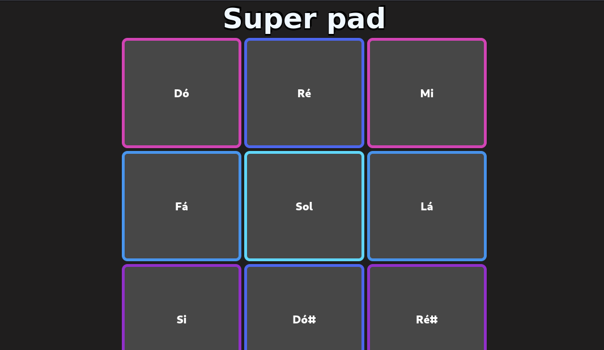

  <h1>Super pad</h1>
   
    
    
     
     
    
Este projeto consiste em um teclado musical composto por 9 quadrados, cada um representando uma nota musical. Ademais, os quadrados mudam de cor quando são tocados, e a pessoa pode escolher entre tocar as notas clicando nos botões ou utilizando os atalhos do teclado.

  ### Atalhos disponíveis:
  
  - **Dó**: `"s"`
  - **Ré**: `"d"`
  - **Mi**: `"j"`
  - **Fá**: `"x"`
  - **Sol**: `"c"`
  - **Lá**: `"k"`
  - **Si**: `"v"`
  - **Dó#**: `"n"`
  - **Ré#**: `"m"`

Desenvolvido por <a target="_blank" rel="external" href="https://github.com/MegMinnie/"><strong>Mirele Oliveira da Silva</strong></a>

  
  ## Como Acessar a Aplicação

Acesse a aplicação por meio do link: <a href="
megminnie.github.io/Super-pad/
"_blank">clique aqui</a>

## *Screenshots*

  

